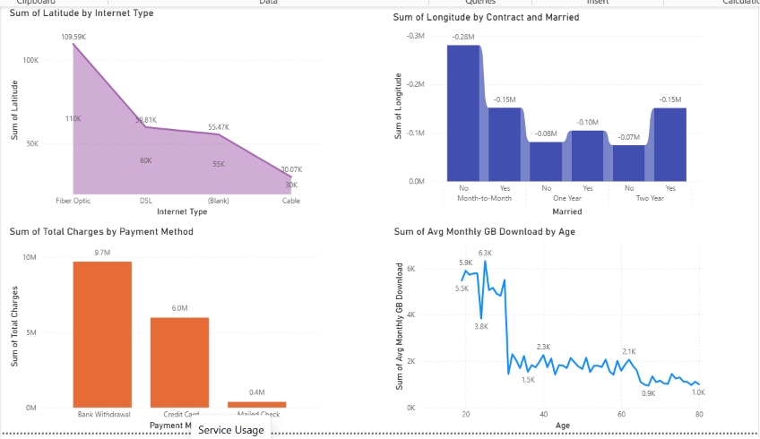

# 📊 Telecom Customer Churn Dashboard

An interactive Power BI dashboard designed to analyze customer churn patterns, demographics, subscription details, and business KPIs.

## 🚀 Project Overview

This project helps businesses understand customer behavior and identify factors contributing to customer churn. The dashboard provides actionable insights to improve customer retention strategies.

## 🛠️ Tools & Technologies

* Power BI
* DAX
* Excel
* Data Modeling
* Data Visualization

## 📈 Dashboard Features

* KPI Cards

  * Total Customers
  * Churn Rate
  * Active Customers
  * Revenue Analysis

* Customer Segmentation

  * Gender Distribution
  * Contract Type Analysis
  * Internet Service Usage

* Churn Analysis

  * Monthly Charges
  * Tenure Analysis
  * Payment Method Insights

* Interactive Filters

  * Gender
  * Contract Type
  * Payment Method
  * Senior Citizen Status

## 📂 Repository Structure

```text
Telecom-Dashboard/
│
├── Telecome.pbix
├── README.md
└── screenshots/
    └── dashboard.png
```

## 📸 Dashboard Preview



## 🎯 Key Insights

* Identified customer segments with higher churn probability.
* Analyzed revenue impact due to customer attrition.
* Provided insights to support data-driven retention strategies.

## 👩‍💻 Author

**Shalini Senthilkumar**

Data Analyst | Power BI | SQL | Python | Excel
